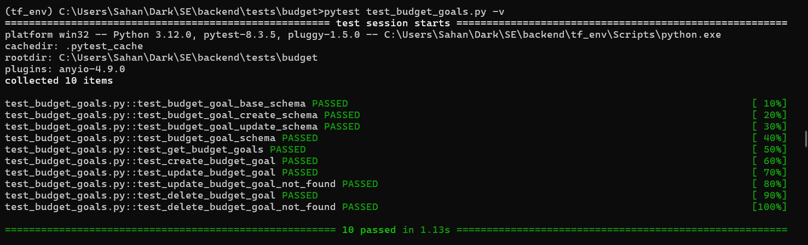
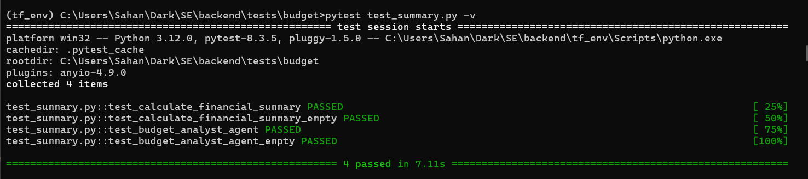
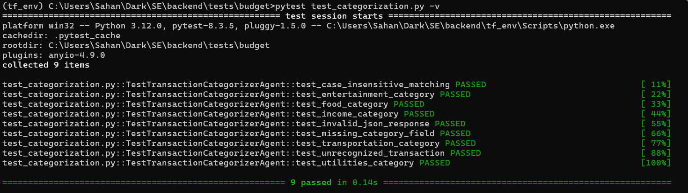
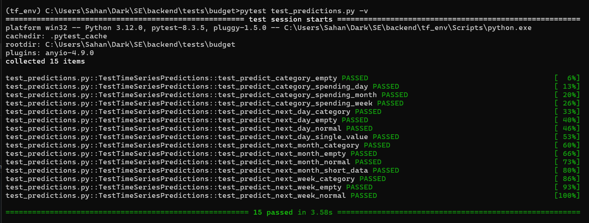
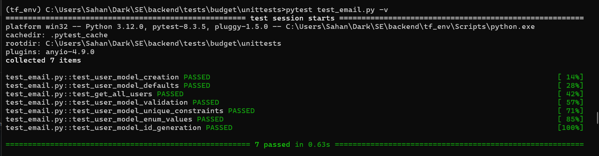
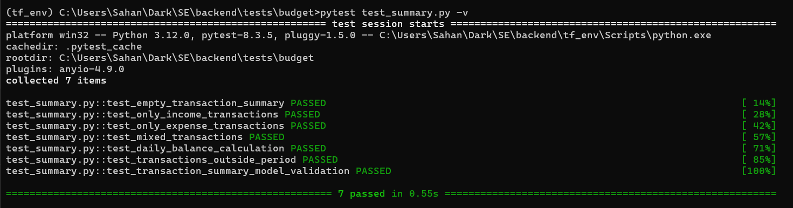
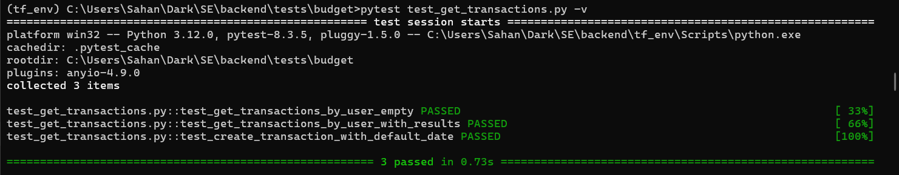
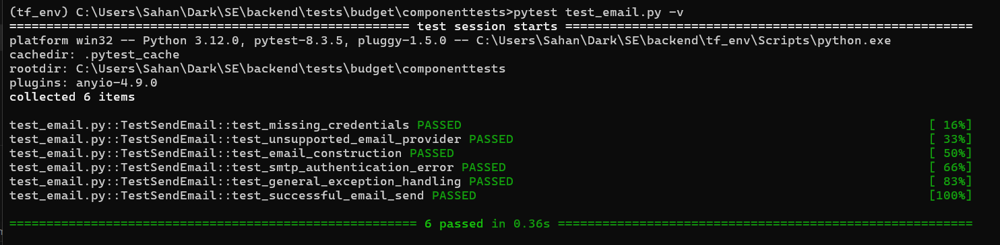
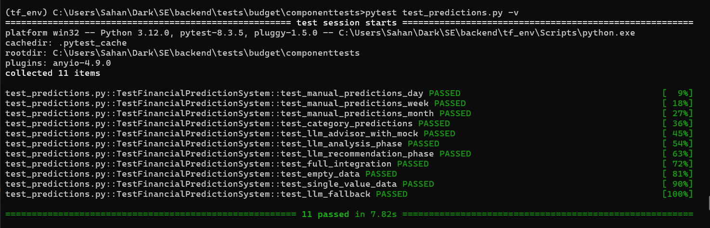
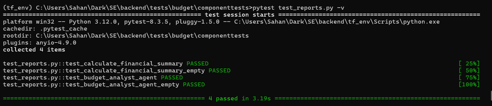

### ✅ **Test Case Document: Financial Application**

#### 📁 Module 1: Budget Goals (`test_budget_goals.py`)

| **Test Case ID** | **Title**                          | **Description**                           | **Input Data**                             | **Expected Result**                       | **Status** |
| ---------------- | ---------------------------------- | ----------------------------------------- | ------------------------------------------ | ----------------------------------------- | ---------- |
| TC\_BG\_001      | Validate `BudgetGoalBase` schema   | Validates initialization and field types  | Title, category, amount, user ID, deadline | Object fields correctly initialized       | Pass       |
| TC\_BG\_002      | Validate `BudgetGoalCreate` schema | Ensures `created_at` is automatically set | Same as above                              | `created_at` is set to current time       | Pass       |
| TC\_BG\_003      | Validate `BudgetGoalUpdate` schema | Ensures optional fields behave correctly  | Partial data (e.g., title, amount)         | Unset fields remain `None`                | Pass       |
| TC\_BG\_004      | Validate full `BudgetGoal` schema  | Validates full goal representation        | Full object with ID and timestamps         | Correct field parsing and object creation | Pass       |
| TC\_BG\_005      | Retrieve budget goals              | Fetch multiple goals ordered by deadline  | Two budget goals                           | Returned in ascending order by deadline   | Pass       |
| TC\_BG\_006      | Create a new budget goal           | Persist a goal in the DB                  | Valid budget goal input                    | Goal appears in DB with correct values    | Pass       |
| TC\_BG\_007      | Update an existing goal            | Modifies a goal’s title and amount        | Update fields                              | Changes are saved and retrievable         | Pass       |
| TC\_BG\_008      | Update non-existent goal           | Tries updating with invalid ID            | Invalid goal ID                            | Raises `HTTPException` with 404 status    | Pass       |
| TC\_BG\_009      | Delete an existing goal            | Removes a goal from DB                    | Valid goal ID                              | Goal is deleted and not found afterward   | Pass       |
| TC\_BG\_010      | Delete non-existent goal           | Tries deleting an invalid goal ID         | Invalid goal ID                            | Raises `HTTPException` with 404 status    | Pass       |

---

#### 📁 Module 2: Budget Report (`test_budget_report.py`)

| **Test Case ID** | **Title**                                 | **Description**                                       | **Input Data**                  | **Expected Result**                                    | **Status** |
| ---------------- | ----------------------------------------- | ----------------------------------------------------- | ------------------------------- | ------------------------------------------------------ | ---------- |
| TC\_BR\_001      | Calculate financial summary - normal data | Validates aggregation of income, expenses, savings    | List of transactions            | Correct totals, top spending categories                | Pass       |
| TC\_BR\_002      | Calculate financial summary - empty data  | Handles empty transaction list                        | Empty list                      | Returns zeros and empty categories                     | Pass       |
| TC\_BR\_003      | Analyze spending - with transactions      | Uses LLM to analyze spending and suggest improvements | List of transactions + mock LLM | Returns dict with summary, recommendations, and alerts | Pass       |
| TC\_BR\_004      | Analyze spending - no transactions        | Ensures graceful handling of no data                  | Empty list + mock LLM           | Returns zero summary and "None" alert                  | Pass       |

---

#### 📁 Module 3: Transaction Categorization (`test_categorization.py`)

| **Test Case ID** | **Title**                      | **Description**                                                   | **Input Data**                    | **Expected Result**                  | **Status** |
| ---------------- | ------------------------------ | ----------------------------------------------------------------- | --------------------------------- | ------------------------------------ | ---------- |
| TC\_CAT\_001     | Categorize food transaction    | Ensures "Whole Foods" is categorized as Food                      | Description, amount, type         | Category = "Food"                    | Pass       |
| TC\_CAT\_002     | Categorize utilities           | Categorizes "Electricity Bill" as Utilities                       | Description, amount, type         | Category = "Utilities"               | Pass       |
| TC\_CAT\_003     | Categorize income              | Categorizes "Monthly Salary" as Work                              | Description, amount, type         | Category = "Work", Type = "income"   | Pass       |
| TC\_CAT\_004     | Categorize entertainment       | Categorizes "Netflix Subscription" correctly                      | Description, amount, type         | Category = "Entertainment"           | Pass       |
| TC\_CAT\_005     | Categorize transportation      | Categorizes "Uber Ride" correctly                                 | Description, amount, type         | Category = "Transportation"          | Pass       |
| TC\_CAT\_006     | Handle invalid JSON            | Raises error on LLM returning invalid JSON                        | Invalid LLM output                | Raises `JSONDecodeError`             | Pass       |
| TC\_CAT\_007     | Missing category in LLM output | Handles partial JSON without crashing                             | Valid fields but missing category | Handles gracefully, category missing | Pass       |
| TC\_CAT\_008     | Case-insensitive matching      | Handles description in various cases (e.g., "WHOLE FOODS MARKET") | Description in upper case         | Still categorized as "Food"          | Pass       |
| TC\_CAT\_009     | Unrecognized transaction       | Falls back to "Other" for unknown descriptions                    | Description not in list           | Category = "Other"                   | Pass       |

---

#### 📁 Module 4: Time Series Predictions (`test_predictions.py`)

| **Test Case ID** | **Title**                                 | **Description**                                                        | **Input Data**                   | **Expected Result**                              | **Status** |
| ---------------- | ----------------------------------------- | ---------------------------------------------------------------------- | -------------------------------- | ------------------------------------------------ | ---------- |
| TC\_TS\_001      | Predict next day spending (normal)        | Uses exponential smoothing to predict next day's total spending        | Valid daily dataframe            | Returns a non-negative float                     | Pass       |
| TC\_TS\_002      | Predict next day spending (empty)         | Handles empty input gracefully                                         | Empty dataframe                  | Returns 0.0                                      | Pass       |
| TC\_TS\_003      | Predict next day spending (single value)  | Returns the same value if only one day’s data is available             | One-day dataframe                | Returns that value exactly                       | Pass       |
| TC\_TS\_004      | Predict next week spending (normal)       | Aggregates and forecasts weekly total                                  | Valid dataframe                  | Returns non-negative float                       | Pass       |
| TC\_TS\_005      | Predict next week spending (empty)        | Handles missing data                                                   | Empty dataframe                  | Returns 0.0                                      | Pass       |
| TC\_TS\_006      | Predict next month spending (normal)      | Forecasts monthly total using exponential smoothing and daily patterns | Valid dataframe with date column | Returns valid prediction                         | Pass       |
| TC\_TS\_007      | Predict next month spending (empty)       | Returns zero for empty input                                           | Empty dataframe                  | Returns 0.0                                      | Pass       |
| TC\_TS\_008      | Predict next month (short data)           | Projects 30-day estimate from fewer records                            | 5-day dataframe                  | Returns (mean \* 30)                             | Pass       |
| TC\_TS\_009      | Predict category spending (day)           | Predicts per category for next day                                     | Category-wise dataframes         | Returns dict of non-negative floats per category | Pass       |
| TC\_TS\_010      | Predict category spending (week)          | Predicts weekly forecast per category                                  | Category-wise dataframes         | Returns dict of non-negative floats per category | Pass       |
| TC\_TS\_011      | Predict category spending (month)         | Predicts monthly forecast per category                                 | Category-wise dataframes         | Returns dict of non-negative floats per category | Pass       |
| TC\_TS\_012      | Predict category spending (empty dict)    | Handles case when no categories are passed                             | Empty dict                       | Returns empty dict                               | Pass       |
| TC\_TS\_013      | `_predict_next_day_category()` accuracy   | Unit test for internal day prediction per category                     | Individual category dataframe    | Returns float, non-negative                      | Pass       |
| TC\_TS\_014      | `_predict_next_week_category()` accuracy  | Unit test for internal weekly forecast                                 | Individual category dataframe    | Returns float, non-negative                      | Pass       |
| TC\_TS\_015      | `_predict_next_month_category()` accuracy | Unit test for internal monthly forecast                                | Individual category dataframe    | Returns float, non-negative                      | Pass       |

---

#### 📁 Module 5: User Model & Database (`test_email.py` continuation)

| **Test Case ID** | **Title**                           | **Description**                                                            | **Input Data**             | **Expected Result**                                                       | **Status** |
| ---------------- | ----------------------------------- | -------------------------------------------------------------------------- | -------------------------- | ------------------------------------------------------------------------- | ---------- |
| TC\_USER\_001    | Create user model (complete fields) | Verifies instantiation of `UserModel` with all required fields             | Valid user data            | Object created with matching fields and types                             | Pass       |
| TC\_USER\_002    | Check default values                | Ensures default values like `id`, `access_level`, and `created_at` are set | Minimal user data          | Auto-generated UUID, access\_level=USER, created\_at is a datetime object | Pass       |
| TC\_USER\_003    | Get all users                       | Mocks DB and checks `getAllUsers` returns all records                      | Mocked `Session`           | Returns list of users, database query is called once                      | Pass       |
| TC\_USER\_004    | Missing required fields             | Checks exception raised when required fields are omitted                   | Missing fields             | Raises `TypeError`                                                        | Pass       |
| TC\_USER\_005    | Validate unique constraints         | Validates that `username` and `email` columns are unique                   | `UserModel.__table__`      | Both columns marked as unique                                             | Pass       |
| TC\_USER\_006    | Enum field validation               | Ensures only valid `Gender` and `AccessLevel` enum values are accepted     | Invalid enums              | Raises `ValueError` for incorrect enum inputs                             | Pass       |
| TC\_USER\_007    | Auto UUID generation                | Ensures `id` is generated correctly if not provided                        | Valid user data without ID | UUID is auto-generated, and is a valid format                             | Pass       |

---

#### 📁 Module 6: Transaction Summary & Daily Balances (`test_summary.py`)

| **Test Case ID** | **Title**                               | **Description**                                                         | **Input Data**                     | **Expected Result**                                              | **Status** |
| ---------------- | --------------------------------------- | ----------------------------------------------------------------------- | ---------------------------------- | ---------------------------------------------------------------- | ---------- |
| TC\_SUM\_001     | Empty transaction summary               | Verifies summary returns all zero values when there are no transactions | No transactions                    | All values 0, empty transaction list                             | Pass       |
| TC\_SUM\_002     | Income-only summary                     | Handles only income transactions across current and previous periods    | Income at days 10 and 40           | Valid income amounts, zero expenses, correct balance             | Pass       |
| TC\_SUM\_003     | Expense-only summary                    | Handles only expense transactions                                       | Expenses at days 15 and 45         | Zero income, valid expenses, correct negative balance            | Pass       |
| TC\_SUM\_004     | Mixed transaction summary               | Includes both income and expense in both periods                        | Mixed income/expenses for 60 days  | Accurate current and previous balances                           | Pass       |
| TC\_SUM\_005     | Daily balance for same day transactions | Validates aggregation of same-day income and expenses                   | 1 income, 2 expenses on same date  | Single daily balance reflecting net result                       | Pass       |
| TC\_SUM\_006     | Transactions outside 60-day window      | Ensures old transactions are excluded from summary                      | Transactions at 65 and 70 days ago | All summary values 0, empty transaction list                     | Pass       |
| TC\_SUM\_007     | Transaction summary schema validation   | Validates Pydantic `TransactionSummary` model using sample data         | Sample dictionary input            | Model is created successfully, all values accessible and correct | Pass       |

---

#### 📁 Module 7: Transaction Management (`test_transactions.py`)

| **Test Case ID** | **Title**                               | **Description**                                              | **Input Data**                   | **Expected Result**                                 | **Status** |
| ---------------- | --------------------------------------- | ------------------------------------------------------------ | -------------------------------- | --------------------------------------------------- | ---------- |
| TC\_TR\_001      | Get transactions by user - no results   | Verifies empty result is returned when no transactions exist | User ID                          | Returns empty list, proper query chain used         | Pass       |
| TC\_TR\_002      | Get transactions by user - with results | Returns list of user transactions ordered by creation date   | User ID with 2 mock transactions | Valid data with correct ordering and field values   | Pass       |
| TC\_TR\_003      | Create transaction with default date    | Ensures a transaction is created using `TransactionCreate`   | Valid transaction input          | Object is created and persisted; fields match input | Pass       |

---

#### 📁 Component Module 1: Email Sending & Budget Report Delivery (`test_email.py` – Component Tests)

| **Test Case ID** | **Title**                              | **Description**                                                     | **Input Data**                              | **Expected Result**                              | **Status** |
| ---------------- | -------------------------------------- | ------------------------------------------------------------------- | ------------------------------------------- | ------------------------------------------------ | ---------- |
| TC\_CMP\_001     | Missing credentials                    | Validates that error is raised if environment variables are not set | No `SENDER_EMAIL` or `SENDER_PASSWORD`      | Raises `ValueError`                              | Pass       |
| TC\_CMP\_002     | Unsupported email provider             | Validates error for unsupported SMTP domains                        | `SENDER_EMAIL=test@unsupported.com`         | Raises `ValueError`                              | Pass       |
| TC\_CMP\_003     | Email construction with all components | Ensures proper HTML email body and structure                        | Mocks for all internal dependencies         | Email constructed and sent, SMTP called          | Pass       |
| TC\_CMP\_004     | SMTP authentication error              | Simulates authentication failure and validates fallback handling    | SMTP login raises `SMTPAuthenticationError` | Error is caught and printed; continues loop      | Pass       |
| TC\_CMP\_005     | General exception handling during send | Simulates general failure (e.g., network or template crash)         | `send_message` raises generic `Exception`   | Error is logged, email loop continues            | Pass       |
| TC\_CMP\_006     | Successful email send                  | Validates complete end-to-end email delivery via mocked SMTP        | Valid environment and mocks                 | Email(s) sent, response includes success message | Pass       |

---

#### 📁 Component Module 2: Financial Prediction & LLM Advisory (`test_predictions.py`)

| **Test Case ID** | **Title**                 | **Description**                                                       | **Input Data**                      | **Expected Result**                                               | **Status** |
| ---------------- | ------------------------- | --------------------------------------------------------------------- | ----------------------------------- | ----------------------------------------------------------------- | ---------- |
| TC\_CMP\_007     | Daily manual prediction   | Predicts next day spending using sample data                          | Sample daily data                   | Returns float ≥ 0                                                 | Pass       |
| TC\_CMP\_008     | Weekly manual prediction  | Predicts next week spending using sample data                         | Sample daily data                   | Returns float ≥ 0                                                 | Pass       |
| TC\_CMP\_009     | Monthly manual prediction | Predicts next month spending using sample data                        | Sample daily data                   | Returns float ≥ 0                                                 | Pass       |
| TC\_CMP\_010     | Category predictions      | Predicts per-category spending using sample data                      | Sample category data                | Returns dict of category: float                                   | Pass       |
| TC\_CMP\_011     | Advisor with mock client  | Tests complete LLM-based analysis & recommendation with mocked client | Mock predictions + transactions     | Returns structured `analysis` and `recommendation` dicts          | Pass       |
| TC\_CMP\_012     | Analysis phase only       | Tests raw LLM analysis extraction logic                               | Mock LLM + predictions/transactions | Returns structured `observations`, `actions`, `risks`, `insights` | Pass       |
| TC\_CMP\_013     | Recommendation phase only | Tests JSON-format LLM recommendation generation                       | Mock LLM + predictions              | Returns valid JSON with time\_period, amount, description         | Pass       |
| TC\_CMP\_014     | Full system integration   | Tests entire pipeline from predictions to LLM feedback                | Sample data + mock client           | Returns all fields in analysis and recommendation correctly       | Pass       |
| TC\_CMP\_015     | Handles empty input data  | Validates behavior when predictions or transactions are empty         | Empty DataFrames and dicts          | Returns fallback or zero values                                   | Pass       |
| TC\_CMP\_016     | Handles single data point | Ensures valid output with minimal data                                | Single-row DataFrame                | Returns valid values without errors                               | Pass       |
| TC\_CMP\_017     | LLM fallback on failure   | Triggers fallback handler on LLM exception                            | Forced exception via mock           | Returns fallback analysis and recommendation                      | Pass       |

---

#### 📁 Component Module 3: Budget Summary & LLM Reporting (`test_report.py`)

| **Test Case ID** | **Title**                                     | **Description**                                                | **Input Data**         | **Expected Result**                                | **Status** |
| ---------------- | --------------------------------------------- | -------------------------------------------------------------- | ---------------------- | -------------------------------------------------- | ---------- |
| TC\_CMP\_018     | Calculate summary with valid transactions     | Validates correct computation of income, expenses, and savings | Valid transaction list | Returns correct totals and top spending categories | Pass       |
| TC\_CMP\_019     | Calculate summary with empty transaction list | Ensures summary returns all zeros with no data                 | No transactions        | All values 0.0, empty top category list            | Pass       |
| TC\_CMP\_020     | LLM budget analyst with transactions          | Validates full LLM-based budget analysis flow                  | Valid transaction list | Returns summary, recommendations, and alerts       | Pass       |
| TC\_CMP\_021     | LLM budget analyst with no data               | Validates response when no transactions exist                  | Empty transaction list | Returns default/fallback alert and zeroed summary  | Pass       |

---

### 🧾 Finalized Master Test Summary

| **Test Layer**          | **Module**                             | **Test Count** |
| ----------------------- | -------------------------------------- | -------------- |
| ✅ Unit Tests            | Budget Goals                           | 11             |
| ✅ Unit Tests            | Budget Reports                         | 4              |
| ✅ Unit Tests            | Categorization                         | 9              |
| ✅ Unit Tests            | Time Series Predictions                | 15             |
| ✅ Unit Tests            | User Model & DB                        | 7              |
| ✅ Unit Tests            | Transaction Summary                    | 7              |
| ✅ Unit Tests            | Transaction Management                 | 3              |
| ✅ Component Tests       | Email Sending & Budget Report Delivery | 6              |
| ✅ Component/Integration | Financial Prediction & LLM Advisory    | 11             |
| ✅ Component/Integration | Budget Summary & LLM Report Generator  | 4              |
| **✅ TOTAL**             | **All Modules Combined**               | **77**         |
